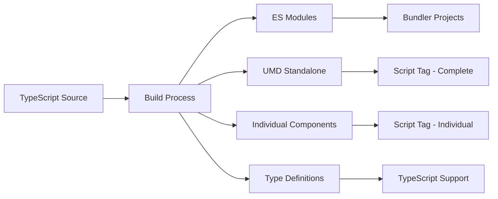

# Sample Design System - Project Architecture

## 🎯 Core Mission

This Design System provides **web components that work everywhere** through a **dual-usage architecture**:

1. **📦 NPM Package** - For modern build tools (Vite, Webpack, Parcel, etc.)
2. **🎯 Drop-in Scripts** - For direct HTML usage without build processes

## 🏗️ Architecture Overview

### Build System Philosophy

We maintain **three distinct build outputs** to serve different consumption patterns:

```
dist/
├── index.es.js         # ES modules for bundlers (~15KB, Lit externalized)
├── standalone/
│   └── index.js        # Complete UMD library (~21KB, Lit bundled)
└── components/
    └── *.js           # Individual UMD components (~21KB each, self-contained)
```

### Why This Approach?

#### For Bundled Projects (ES Modules)
- **Optimal bundle size** - Lit is treated as peer dependency
- **Tree shaking** - Only import components you use
- **Shared dependencies** - Lit instance shared across all components
- **Framework integration** - Works seamlessly with React, Vue, Angular, Svelte

#### For Script Tag Usage (UMD)
- **Zero setup** - No build tools required
- **Self-contained** - Everything needed is in one file
- **Progressive enhancement** - Add components incrementally
- **Legacy compatibility** - Works in any environment

## 🔧 Development Principles

### 1. Component Architecture

Every component follows this structure:

```
src/components/sample-[name]/
├── index.ts                # Export and registration
└── sample-[name].ts       # Component implementation
```

**Key patterns:**
- Web component tag: `sample-[name]`
- Class name: `Sample[Name]`
- CSS custom properties for theming
- Event-driven communication
- Slot-based content projection

### 2. CSS Theming Strategy

```css
:host {
  /* Define custom properties with fallbacks */
  --sample-button-bg: var(--sample-primary-color, #007bff);
  --sample-button-color: var(--sample-text-color, white);
  --sample-button-padding: var(--sample-spacing-md, 8px 16px);
}
```

This ensures consistent theming across **both usage patterns**.

### 3. Build Pipeline



## 📝 Development Workflow

### Starting Development
```bash
npm run dev      # Component development server
npm run demo     # Standalone component testing
```

### Building for Production
```bash
npm run build    # Build all formats
```

### Testing Both Patterns
- **Bundled**: `http://localhost:5173/dev/`
- **Standalone**: `http://localhost:5173/demo/`

## 🎨 Component Creation Guidelines

### 1. Create Component Files
```bash
mkdir src/components/sample-newcomponent
touch src/components/sample-newcomponent/index.ts
touch src/components/sample-newcomponent/sample-newcomponent.ts
```

### 2. Use Code Snippets
- Type `ds-component` for Design System component template
- Type `lit-component` for basic Lit component template

### 3. Register Component
Add to `src/index.ts`:
```typescript
export { SampleNewComponent } from './components/sample-newcomponent/index.js';
```

### 4. Test Both Modes
- Add to `dev/index.html` for bundled testing
- Create demo file in `demo/` for standalone testing

## 🚀 Usage Examples

### NPM Package Usage

```bash
npm install sample-design-system
```

```javascript
// Individual component (recommended)
import 'sample-design-system/components/sample-button';

// Component class for manual registration
import { SampleButton } from 'sample-design-system';

// Everything at once
import 'sample-design-system';
```

### Script Tag Usage

```html
<!-- Individual component -->
<script src="https://unpkg.com/sample-design-system/dist/components/sample-button.js"></script>

<!-- Complete library -->
<script src="https://unpkg.com/sample-design-system/dist/standalone/index.js"></script>
```

## 🔍 Quality Assurance

### Build Verification Checklist
- [ ] ES modules build (~15KB, externalized Lit)
- [ ] Standalone UMD build (~21KB, bundled Lit)
- [ ] Individual components build (~21KB each)
- [ ] TypeScript definitions generated
- [ ] Components work in dev server
- [ ] Components work in demo server
- [ ] CSS theming works in both modes

### Code Standards
- ESLint + TypeScript strict mode
- Lit best practices (decorators, styles, templates)
- CSS custom properties for all styling
- Comprehensive JSDoc documentation
- Global type declarations

## 🎯 Success Metrics

A well-implemented component should:

1. **Work identically** in both NPM and script tag usage
2. **Maintain consistent styling** through CSS custom properties
3. **Provide TypeScript support** with full intellisense
4. **Emit proper events** for framework integration
5. **Support theming** through CSS custom properties
6. **Be accessibility compliant** (ARIA, keyboard navigation)

## 🤝 Contributing Guidelines

When adding new components:

1. Follow the established component structure
2. Test in both bundled and standalone modes  
3. Update main index.ts exports
4. Add TypeScript definitions
5. Create demo pages for both usage patterns
6. Document CSS custom properties
7. Verify build outputs are correct

This architecture ensures our Design System components work everywhere while maintaining optimal performance for each usage pattern. 