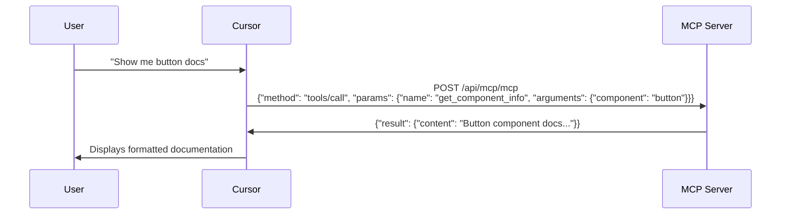

# Model Context Protocol (MCP) Server

This design system provides a **Model Context Protocol (MCP) Server** that follows the [JSON-RPC 2.0 specification](https://modelcontextprotocol.io/llms-full.txt) exactly. The server enables AI assistants to access design system documentation and get implementation guidance.

## 🤖 What is a Model Context Protocol (MCP) Server?

The **Model Context Protocol (MCP)** is an open standard that allows AI assistants to securely connect to external data sources and tools. Think of it as a bridge that lets your AI coding assistant access specialized knowledge and functionality beyond its built-in capabilities.

### How MCP Works

1. **Protocol Communication**: MCP servers communicate using **JSON-RPC 2.0** over various transports (HTTP, stdio, SSE)
2. **HTTP Transport**: Our server uses **HTTP requests** - when you ask your AI assistant a question, it sends JSON-RPC requests to `https://sample-ds.vercel.app/api/mcp/mcp`
3. **Three Main Capabilities**:
   - **🛠️ Tools** - Interactive functions the AI can call (like `get_component_info`)
   - **📋 Resources** - Structured data the AI can read (like component documentation)
   - **💡 Prompts** - Pre-configured prompt templates for common tasks

### Example HTTP Flow

When you ask Cursor *"Show me the button component documentation"*, here's what happens:



### Why Use MCP?

- **🔒 Secure**: Controlled access to your data and tools
- **🔌 Extensible**: Add new capabilities without modifying the AI assistant
- **📚 Contextual**: Provide domain-specific knowledge (like design system docs)
- **⚡ Real-time**: Access live data and execute actions

## 🚀 Quick Start

The MCP server is available at these endpoints:

- **Production URL**: `https://sample-ds.vercel.app/api/mcp/mcp`
- **Local Development**: `http://localhost:3000/api/mcp/mcp`
- **Transport**: JSON-RPC 2.0 over HTTP

## ✅ MCP Specification Compliance

Following the [official MCP specification](https://modelcontextprotocol.io/llms-full.txt), our implementation includes:

- ✅ **JSON-RPC 2.0 Protocol** - Strict protocol compliance
- ✅ **Tools Support** - Compatible with all MCP clients
- ✅ **Resources Support** - Structured data access
- ✅ **Prompts Support** - Interactive prompt templates
- ✅ **Proper Initialization** - MCP handshake protocol
- ✅ **Error Handling** - Standard JSON-RPC error codes
- ✅ **Logging** - Stderr logging for debugging
- ✅ **CORS Support** - Remote client compatibility

### Client Compatibility

Based on the [MCP client feature matrix](https://modelcontextprotocol.io/llms-full.txt):

| Client | Tools | Resources | Prompts | Support Status |
|--------|-------|-----------|---------|----------------|
| **Cursor** | ✅ | ❌ | ❌ | **Tools Only** |
| **Claude Desktop** | ✅ | ✅ | ✅ | **Full Support** |
| **Claude.ai** | ✅ | ✅ | ✅ | **Full Support** |
| **VS Code GitHub Copilot** | ✅ | ✅ | ✅ | **Full Support** |
| **Continue** | ✅ | ✅ | ✅ | **Full Support** |

## 🔗 Connecting to AI Clients

### Cursor

**🚀 Quick Install** (Recommended):

<a href="cursor://anysphere.cursor-deeplink/mcp/install?name=sample-design-system&config=eyJjb21tYW5kIjoibnB4IiwiYXJncyI6WyJtY3AtcmVtb3RlIiwiLXkiLCJodHRwczovL3NhbXBsZS1kcy52ZXJjZWwuYXBwL2FwaS9tY3AvbWNwIl19" style="display: inline-block; background: #000; color: white; padding: 12px 24px; border-radius: 6px; text-decoration: none; font-weight: 600; font-family: system-ui;">📦 Add to Cursor</a>

**Manual Setup**:

1. Open your Cursor MCP configuration file:
   - **macOS/Linux**: `~/.cursor/mcp.json`
   - **Windows**: `%USERPROFILE%\.cursor\mcp.json`

2. Add this configuration:

```json
{
  "sample-design-system": {
    "command": "npx",
    "args": [
      "mcp-remote",
      "-y",
      "https://sample-ds.vercel.app/api/mcp/mcp"
    ]
  }
}
```

3. Restart Cursor for the changes to take effect

> **Note**: The quick install button uses [Cursor's MCP deeplink feature](https://docs.cursor.com/deeplinks#html) to automatically configure the server for you.

### Claude Desktop

Add this to your `claude_desktop_config.json` file:

```json
{
  "mcpServers": {
    "sample-design-system": {
      "command": "npx",
      "args": [
        "mcp-remote",
        "-y",
        "https://sample-ds.vercel.app/api/mcp/mcp"
      ]
    }
  }
}
```

**Config file locations:**
- **macOS**: `~/Library/Application Support/Claude/claude_desktop_config.json`
- **Windows**: `%APPDATA%\Claude\claude_desktop_config.json`

### VS Code GitHub Copilot

**🚀 Quick Install** (Recommended):

<a href="vscode:mcp/install?%7B%22name%22%3A%22sample-design-system%22%2C%22command%22%3A%22npx%22%2C%22args%22%3A%5B%22mcp-remote%22%2C%22-y%22%2C%22https%3A//sample-ds.vercel.app/api/mcp/mcp%22%5D%7D" style="display: inline-block; background: #007ACC; color: white; padding: 12px 24px; border-radius: 6px; text-decoration: none; font-weight: 600; font-family: system-ui;">🔧 Add to VS Code</a>

**Manual Setup**:

1. **Enable MCP support**: Make sure you have the latest version of VS Code and GitHub Copilot extension

2. **Create/Edit configuration file**:
   - Open Command Palette (`Ctrl+Shift+P` / `Cmd+Shift+P`)
   - Run: `MCP: Edit Configuration`
   - Or manually create `.vscode/mcp.json` in your workspace root

3. **Add this configuration**:

```json
{
  "servers": {
    "sample-design-system": {
      "command": "npx",
      "args": [
        "mcp-remote",
        "-y",
        "https://sample-ds.vercel.app/api/mcp/mcp"
      ]
    }
  }
}
```

4. **Restart VS Code** or run `MCP: Restart All Servers` from the Command Palette

5. **Verify installation**: 
   - Open Command Palette → `MCP: List Servers`
   - You should see "sample-design-system" listed
   - Try asking GitHub Copilot: *"List all design system components"*

> **Note**: The quick install button uses [VS Code's MCP URL handler](https://code.visualstudio.com/docs/copilot/chat/mcp-servers) to automatically configure the server. This requires MCP support in VS Code (available in recent versions).

## 🛠️ Available Tools

### 1. **list_components**
Lists all available design system components with their basic information.

**Schema:**
```json
{
  "name": "list_components",
  "description": "Lists all available design system components with their basic information",
  "inputSchema": {
    "type": "object",
    "properties": {},
    "additionalProperties": false
  }
}
```

**Usage:**
```json
{
  "jsonrpc": "2.0",
  "id": 1,
  "method": "tools/call",
  "params": {
    "name": "list_components",
    "arguments": {}
  }
}
```

---

### 2. **get_component_info**
Gets detailed information about a specific design system component.

**Schema:**
```json
{
  "name": "get_component_info", 
  "description": "Gets detailed information about a specific design system component including usage examples, props, and implementation details",
  "inputSchema": {
    "type": "object",
    "properties": {
      "component": {
        "type": "string",
        "description": "The component name (e.g., 'button', 'card', 'alert')",
        "enum": ["accordion", "button", "card", "alert", "modal", "breadcrumb"]
      }
    },
    "required": ["component"],
    "additionalProperties": false
  }
}
```

**Usage:**
```json
{
  "jsonrpc": "2.0",
  "id": 2,
  "method": "tools/call",
  "params": {
    "name": "get_component_info",
    "arguments": {
      "component": "button"
    }
  }
}
```

---

### 3. **get_system_architecture**
Provides detailed information about the design system architecture and technical specifications.

**Schema:**
```json
{
  "name": "get_system_architecture",
  "description": "Provides detailed information about the design system architecture, browser support, and technical specifications",
  "inputSchema": {
    "type": "object",
    "properties": {},
    "additionalProperties": false
  }
}
```

**Usage:**
```json
{
  "jsonrpc": "2.0",
  "id": 3,
  "method": "tools/call",
  "params": {
    "name": "get_system_architecture",
    "arguments": {}
  }
}
```

## 📋 Available Resources

The server provides structured access to design system data through these resources:

### 1. **design-system://components/all**
Complete documentation for all components in JSON format.

**Content:**
- All component definitions and documentation
- System information and metadata  
- Total component count

**Usage:**
```json
{
  "jsonrpc": "2.0",
  "id": 4,
  "method": "resources/read",
  "params": {
    "uri": "design-system://components/all"
  }
}
```

---

### 2. **design-system://architecture**
Technical architecture and implementation details.

**Content:**
- Framework compatibility information
- Bundle size and performance metrics
- Technical specifications
- Build and deployment details

**Usage:**
```json
{
  "jsonrpc": "2.0", 
  "id": 5,
  "method": "resources/read",
  "params": {
    "uri": "design-system://architecture"
  }
}
```

---

### 3. **design-system://browser-support**
Browser compatibility matrix and feature support information.

**Content:**
- Browser support matrix with version requirements
- Feature compatibility details
- Polyfill requirements and recommendations

**Usage:**
```json
{
  "jsonrpc": "2.0",
  "id": 6, 
  "method": "resources/read",
  "params": {
    "uri": "design-system://browser-support"
  }
}
```

## 💡 Available Prompts

Interactive prompt templates for common design system tasks:

### 1. **component_integration**
Get step-by-step integration instructions for a specific component.

**Arguments:**
- `component` (required) - The component to integrate
- `framework` (optional) - Target framework (vanilla, react, vue, angular, svelte)

**Usage:**
```json
{
  "jsonrpc": "2.0",
  "id": 7,
  "method": "prompts/get", 
  "params": {
    "name": "component_integration",
    "arguments": {
      "component": "button",
      "framework": "react"
    }
  }
}
```

---

### 2. **troubleshoot_component**
Get help troubleshooting component implementation issues.

**Arguments:**
- `component` (required) - Component having issues
- `issue` (required) - Description of the problem
- `framework` (optional) - Framework being used

**Usage:**
```json
{
  "jsonrpc": "2.0",
  "id": 8,
  "method": "prompts/get",
  "params": {
    "name": "troubleshoot_component",
    "arguments": {
      "component": "modal",
      "issue": "Modal not showing properly on mobile",
      "framework": "vue"
    }
  }
}
```

---

### 3. **design_review**
Review code for design system best practices and compliance.

**Arguments:**
- `code` (required) - Code to review
- `focus` (optional) - What to focus on (accessibility, performance, best-practices)

**Usage:**
```json
{
  "jsonrpc": "2.0",
  "id": 9,
  "method": "prompts/get",
  "params": {
    "name": "design_review", 
    "arguments": {
      "code": "<sample-button variant=\"primary\">Click me</sample-button>",
      "focus": "accessibility"
    }
  }
}
```

## 🎯 Example Usage

Here's how you can use the MCP server in your AI client:

### Tools
1. **List all components:**
   ```
   Use the list_components tool to see all available components
   ```

2. **Get specific component info:**
   ```
   Use get_component_info with component "button" to see button documentation
   ```

3. **Check system architecture:**
   ```
   Use get_system_architecture to understand the technical details
   ```

### Resources  
4. **Access all component documentation:**
   ```
   Read the "design-system://components/all" resource for complete component data
   ```

5. **Get browser compatibility info:**
   ```
   Read the "design-system://browser-support" resource for compatibility matrix
   ```

### Prompts
6. **Get integration help:**
   ```
   Use the "component_integration" prompt with component "card" and framework "react"
   ```

7. **Troubleshoot issues:**
   ```
   Use the "troubleshoot_component" prompt to get help with implementation problems
   ```

8. **Review your code:**
   ```
   Use the "design_review" prompt to check your implementation for best practices
   ```

## 📦 Components Available

- **Button** - Interactive button with multiple variants (primary, secondary, outline)
- **Card** - Flexible container for content grouping with elevation options
- **Alert** - Notification component for messages (info, success, warning, error)
- **Modal** - Overlay component for dialogs with slot-based content
- **Accordion** - Collapsible content sections with keyboard navigation
- **Breadcrumb** - Navigation hierarchy component with custom separators

## 🔧 Technical Implementation

### Built With
- **JSON-RPC 2.0** - Standard protocol compliance
- **Next.js Pages Router** - API route handling
- **Custom MCP Implementation** - No external dependencies
- **Web Components** - sample-design-system-educkf package

### Features
- ✅ **HTTP Transport** - Direct HTTP requests with CORS support
- ✅ **Tool Calling** - Interactive design system assistance
- ✅ **Schema Validation** - Input validation with proper error responses
- ✅ **Error Handling** - Standard JSON-RPC 2.0 error codes
- ✅ **Logging** - Debug logs to stderr (follows MCP specification)
- ✅ **State Management** - Proper initialization handshake

### Protocol Support

The server implements these JSON-RPC 2.0 methods:

| Method | Description | Status |
|--------|-------------|---------|
| `initialize` | Server initialization handshake | ✅ |
| `tools/list` | List available tools | ✅ |
| `tools/call` | Execute a tool | ✅ |
| `resources/list` | List available resources | ✅ |
| `resources/read` | Read a specific resource | ✅ |
| `prompts/list` | List available prompts | ✅ |
| `prompts/get` | Get a specific prompt | ✅ |
| `initialized` | Client notification (no response) | ✅ |

### Error Codes

Following JSON-RPC 2.0 specification:

| Code | Error | Description |
|------|-------|-------------|
| `-32700` | Parse Error | Invalid JSON |
| `-32600` | Invalid Request | Invalid JSON-RPC request |
| `-32601` | Method Not Found | Unknown method |
| `-32602` | Invalid Params | Invalid parameters |
| `-32603` | Internal Error | Server error |

## 🚀 Getting Started

1. **Verify the server is running:**
   ```bash
   curl -X POST https://sample-ds.vercel.app/api/mcp/mcp \
     -H "Content-Type: application/json" \
     -d '{"jsonrpc":"2.0","id":1,"method":"initialize","params":{"protocolVersion":"2025-06-18","capabilities":{"tools":{}},"clientInfo":{"name":"test","version":"1.0.0"}}}'
   ```

2. **Configure your AI client** using the connection details above (use the quick install buttons for fastest setup)

3. **Test the connection** by asking your AI client to list components:
   ```
   Can you list all the design system components available?
   ```

### 🏠 Local Development

To run this MCP server locally for development:

```bash
# Clone the repository
git clone https://github.com/your-repo/sample-ds
cd sample-ds/docs

# Install dependencies  
npm install

# Start the development server
npm run dev

# The local MCP server will be available at:
# http://localhost:3000/api/mcp/mcp
```

## 🔍 Troubleshooting

### Common Issues

1. **Connection Refused**
   - Verify the production server is accessible: `curl https://sample-ds.vercel.app/api/mcp/mcp`
   - Check your internet connection
   - Verify the URL in your client configuration matches exactly
   - For local development: make sure `npm run dev` is running and port 3000 is available

2. **HTTP Transport Issues**
   - Our MCP server uses **HTTP requests** (not stdio/SSH)
   - Each AI assistant request becomes a `POST` to `https://sample-ds.vercel.app/api/mcp/mcp`
   - Check browser developer tools or server logs to see actual HTTP traffic
   - Verify CORS headers are present in responses

3. **Invalid JSON-RPC Response**
   - Ensure you're sending proper JSON-RPC 2.0 format
   - Check that `jsonrpc: "2.0"` is included in requests
   - Verify Content-Type is `application/json`
   - Must include `id` field for request/response correlation

4. **MCP Protocol Errors**
   - Server must be **initialized first** with `initialize` method
   - Tool Not Found: Use exact tool names (`list_components`, `get_component_info`, `get_system_architecture`)
   - Invalid Params: Verify tool arguments match the schema
   - Check server supports your client's capabilities (tools/resources/prompts)

5. **Client-Specific Issues**
   - **Cursor**: 
     - Config file: `~/.cursor/mcp.json` (Unix) or `%USERPROFILE%\.cursor\mcp.json` (Windows)
     - Restart Cursor after config changes
     - Only supports **tools** (not resources/prompts)
   - **Claude Desktop**: 
     - Config file: `~/Library/Application Support/Claude/claude_desktop_config.json` (macOS)
     - Check logs: `~/Library/Logs/Claude/mcp*.log`
     - Supports **full MCP** (tools, resources, prompts)
   - **VS Code**: 
     - Config file: `.vscode/mcp.json` in workspace
     - Use Command Palette: `MCP: List Servers` to check status
     - Run `MCP: Restart All Servers` after config changes
   - **All clients**: Ensure `npx` and `mcp-remote` are available in PATH

### Debug Information

**Production Server**: The production MCP server at `https://sample-ds.vercel.app/api/mcp/mcp` logs are available in the Vercel deployment dashboard.

**Local Development**: When running `npm run dev` locally, the MCP server logs all requests to stderr:

```
[MCP] Received initialize (id: 1)
[MCP] Initializing with client: test-client v1.0.0
[MCP] Protocol version: 2025-06-18
[MCP] Received tools/list (id: 2) 
[MCP] Listing 3 available tools
[MCP] Received tools/call (id: 3)
[MCP] Calling tool: list_components
```

### Testing HTTP Requests Directly

Since our MCP server uses HTTP transport, you can test it directly with HTTP requests:

**1. Initialize the server:**
```bash
curl -X POST https://sample-ds.vercel.app/api/mcp/mcp \
  -H "Content-Type: application/json" \
  -d '{
    "jsonrpc": "2.0",
    "id": 1,
    "method": "initialize",
    "params": {
      "protocolVersion": "2025-06-18",
      "capabilities": {"tools": {}, "resources": {}, "prompts": {}},
      "clientInfo": {"name": "test-client", "version": "1.0.0"}
    }
  }'
```

**2. List available tools:**
```bash
curl -X POST https://sample-ds.vercel.app/api/mcp/mcp \
  -H "Content-Type: application/json" \
  -d '{
    "jsonrpc": "2.0",
    "id": 2,
    "method": "tools/list",
    "params": {}
  }'
```

**3. Call a tool:**
```bash
curl -X POST https://sample-ds.vercel.app/api/mcp/mcp \
  -H "Content-Type: application/json" \
  -d '{
    "jsonrpc": "2.0",
    "id": 3,
    "method": "tools/call",
    "params": {
      "name": "list_components",
      "arguments": {}
    }
  }'
```

### Testing with MCP Inspector

You can also test the server using the [MCP Inspector](https://github.com/modelcontextprotocol/inspector):

```bash
npx @modelcontextprotocol/inspector https://sample-ds.vercel.app/api/mcp/mcp
```

The Inspector provides a GUI to test all MCP capabilities interactively.

## 📄 License

This MCP server implementation is part of the Sample Design System project.

---

*Need help? Check the [Model Context Protocol documentation](https://modelcontextprotocol.io/) for more details. The server follows the specification at [https://modelcontextprotocol.io/llms-full.txt](https://modelcontextprotocol.io/llms-full.txt) exactly.* 